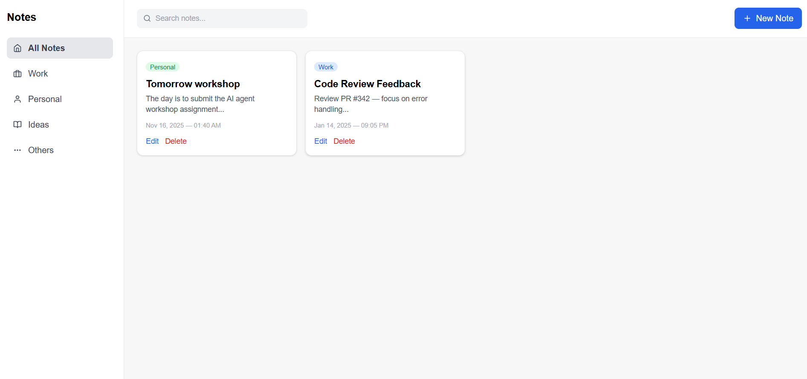
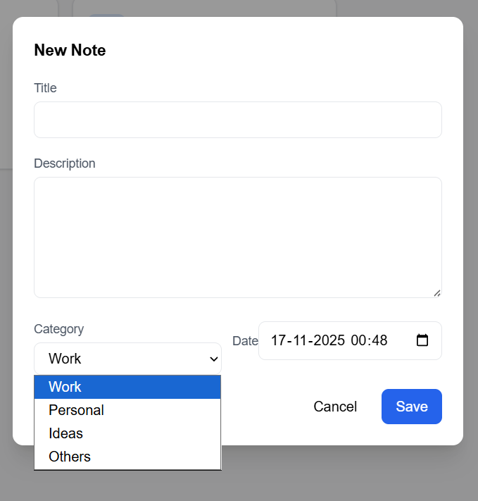

# 📝 Notes App – React + Vite + TailwindCSS

A clean, modern, and responsive **Notes Management Web App** built with  
**React**, **Vite**, **TailwindCSS**, **dayjs**, and **localStorage**.

This app allows you to create, edit, search, delete, and categorize notes with a beautiful UI inspired by Apple Notes & Evernote.

---

## 🚀 Live Demo  
🔗 https://notes-app-smoky-rho.vercel.app/

---

## 🛡️ Badges

---

## 📸 Screenshots

### Dashboard UI  

### Create / Edit Note Modal  

---

## ✨ Features

### 📁 Note Management
- Create, edit, and delete notes  
- Auto-saves using **localStorage**
- Load initial sample notes from `public/notes.json`

### 🗂 Categories
- Filter by: **All Notes**, Work, Personal, Ideas, Others

### 🔎 Search
- Search notes by title or description (real-time)

### 🪟 Modal Form
- Clean popup UI for note creation & editing
- Fields: Title, Description, Category, Timestamp

### 🎨 Modern UI
- Sidebar with icons  
- Top navbar with search  
- Responsive note grid  
- Smooth animations  
- TailwindCSS styling  

---

## 🛠️ Tech Stack

| Technology | Purpose |
|------------|----------|
| **React** | Component-based UI |
| **Vite** | Fast development + build |
| **TailwindCSS** | Styling framework |
| **dayjs** | Date handling |
| **react-icons** | Icons |
| **localStorage** | Data persistence |

---

## 📁 Folder Structure

---

## 📦 Installation

### 1️⃣ Clone the repository

bash
git clone https://github.com/<your-username>/notes-app.git
cd notes-app

### 2️⃣ Install dependencies
npm install

### 3️⃣ Install required packages
npm install react-icons dayjs

### 4️⃣ Start development server
npm run dev

App runs at:

👉 http://localhost:5173/

### 🏗️ Build for Production
npm run build
npm run preview

